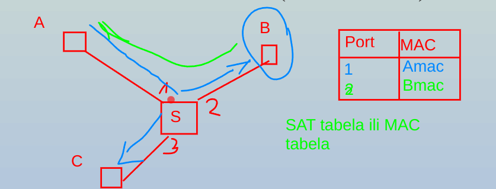
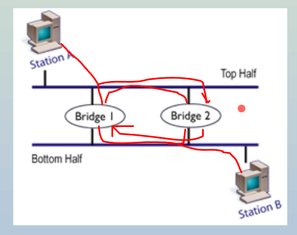

## Ripiter (Repeater)

* Pojačava ili regeniše signal. Ne obraća pažnju na protokoli

## Koncertrator (Hub)

* Ripiter sa više portova. 

## Most (Bridge) / Switch

* Rade o sloju veze
* Raspolažu tabelama o MAC adresama
* Povećavanje performansi mreže, mostovima se deli mreža na više koliozionih domena.
* Switch ima tabelu sa adresama Port:MAC. Zove to **Source Allocation Table** (SAT).



* Ponekad moze biti petlja. Zbog toga imamo Spanning Tree Prtotocol (STP) protokol gde možemo disable žice.


> MAC adresa - adresa uredaja (fabrika je upise)

## Router

* Rade u sloju mreže (3. sloj)
* 

## Mrežni prolaz (Gatewaz)

* Inteligentni uređaj sa visim slojevima, iznad 3. sloja.

## Osnovne karakteristika kanala

* Širina kanala (Propusna moć u Hz)
* Šum
* Šema kodovanja

## Osnovne prenose podataka

**Maks brzina podataka = H log2(1+S/N) [(M/G)b/s]**

**Maks brzina podataka = 2H log2(V) [(M/G)b/s]**

* S - snaga signala
* G - Snaga šuma Gaus raspodele
* H - Merna jedinica (MHz, Hz). Širina kanala koliko maks može prođi frekvencija kroz kanal
* (M/G)b/s - brzina podataka. Zavisi od merni jedinici.

```
Zadatak:
Kanal širine 1MHz
SNR=63
===
Maksimalna brzina prenosa?
```