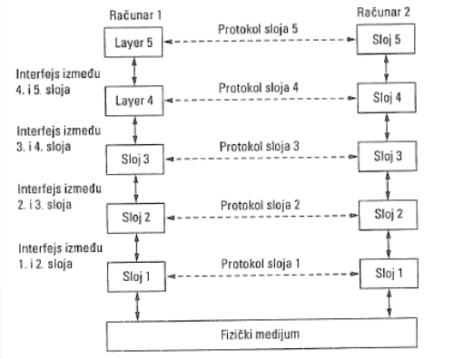

# Arhitektura mreža

**Mrežna arhitektura** - skup slojeva i protokola

## ISO/OSI Arhitektura

### Standardi: 
* **ISO** - International Organization for Standardisation
* **OSI**- Open System Interconnection

**RFC Request for Comments** se na mreži prodiskutuje,
kao i na *IETF Internet Engineering Task Force susretima* radne
grupe, i preporu če jedan standard, koji stoji šest meseci i testira se. Ispravlja se, i nakon nekoliko meseci dolazi na prihvatanje.

### Protokoli:
Saradnja me đusobno nezavisnih protokola bi nila
nemoguća bez slojeva. 

> Unutrašnje promene jednog sloja ne utiču na
druge slojeve. 

#### Primer:

* SDU (service data unit) - Podatak koji se prenosi između slojeva . 
* PDU (protocol data unit) - Odgovarajući podatak između dve mašine
* **PCI (protocol control information)** - Informacija koja podržava protok informacije.

